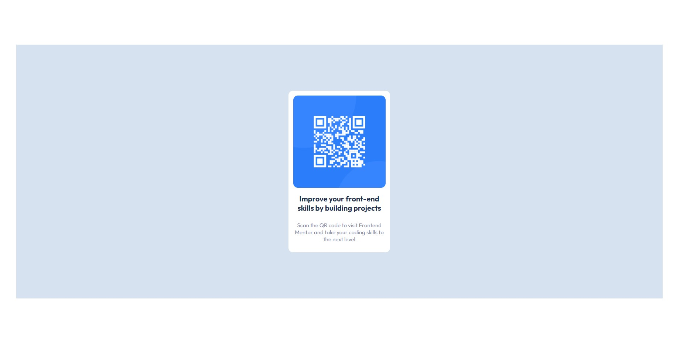
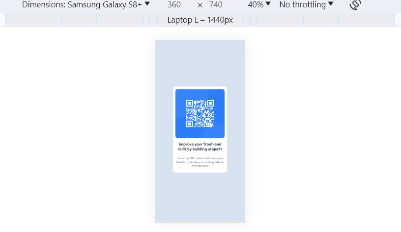

# Frontend Mentor - QR code component solution

This is a solution to the [QR code component challenge on Frontend Mentor](https://www.frontendmentor.io/challenges/qr-code-component-iux_sIO_H). Frontend Mentor challenges help you improve your coding skills by building realistic projects. 

## Table of contents

- [Overview](#overview)
  - [Screenshot](#screenshot)

## Overview

This has been an interesting first challenge on the website, it took me some time to complete it albeit its simplicity but I am still a beginner in designing and front-end.

### Screenshot

- Live Site URL: [Add live site URL here](https://your-live-site-url.com)

## My process

### Built with

- Flexbox
- Mobile-first workflow

### What I learned

I have learned positioning items is not easy as it seems and a lot of functionality that we take for granted on the web has a lot of effort put into it.

